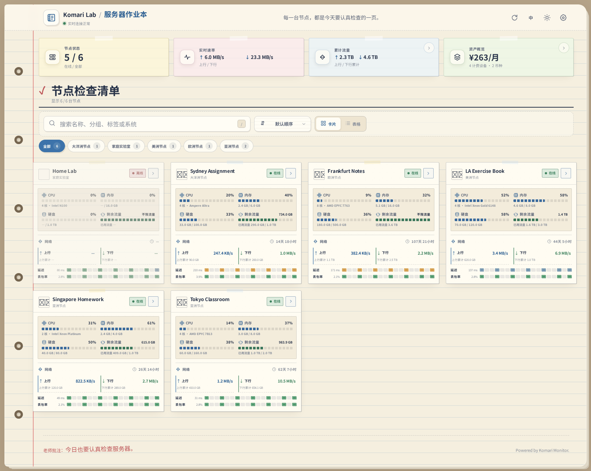
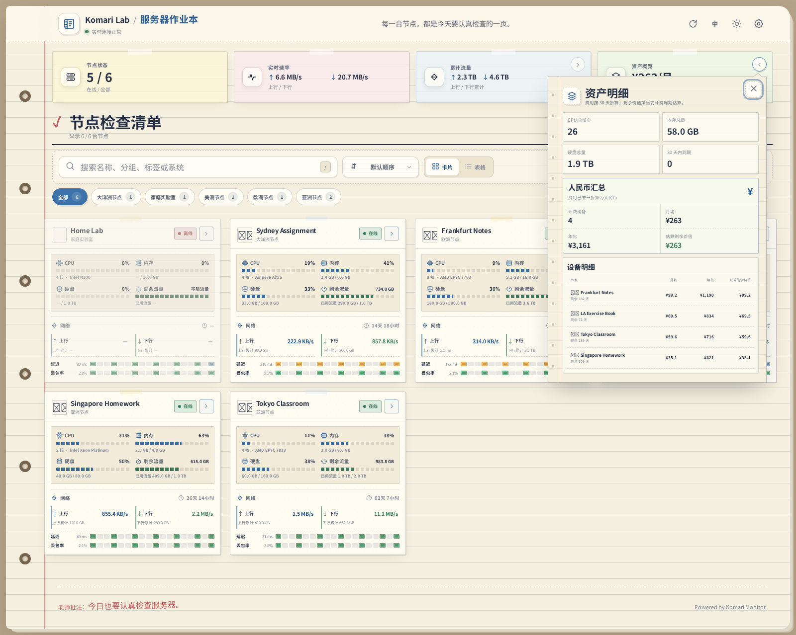

# Komari Notebook 作业本主题

一款为 [Komari Monitor](https://github.com/komari-monitor/komari) 设计的作业本风格主题。以横线纸、索引卡、批注笔迹和账本式数据布局为视觉语言，在桌面端提供三列或四列的高密度节点总览。



## 功能亮点

- 三列、四列节点卡片可在主题设置中切换
- CPU、内存、硬盘和剩余流量采用统一的 2×2 资源区
- 上下行速率、累计流量、运行时间、延迟和丢包率集中展示
- 无限流量节点仍显示实际已用流量和完整进度条
- 资产费用统一折算成人民币，提供月均、年化与估算剩余价值
- 资产与累计流量详情使用按钮锚定悬浮纸片，支持点击外部或 `Esc` 关闭
- 卡片视图与无横向滚动条的表格视图
- 节点详情包含资源、网络、多线路 Ping 和交互式历史图表
- 支持浅色、深色、中英文以及 Komari 托管主题设置
- 实时刷新间隔支持 1–60 秒



## 安装

1. 从 [Releases](https://github.com/Wyk521/komari-theme-notebook/releases) 下载 `KomariNotebook-v0.8.1-install.zip`。
2. 进入 Komari 管理后台的主题管理页面。
3. 上传 ZIP 并启用 `Komari Notebook 作业本`。
4. 根据需要选择三列或四列、刷新间隔、纸张色调及其他显示选项。

安装包根目录已经包含 Komari 所需的文件：

```text
komari-theme.json
preview.png
dist/
```

## 本地构建

需要 Node.js 18 或更高版本。

```bash
npm run check
npm run build
```

构建结果位于 `dist/`。本主题无运行时第三方依赖。

## 项目结构

```text
src/                  主题源码
dist/                 可直接部署的构建产物
scripts/              构建与结构检查脚本
screenshots/          项目截图
release/              Komari 可导入安装包
komari-theme.json     托管主题清单与设置项
preview.png           Komari 主题预览图
```

## v0.8.1

- 将资产与流量详情改为紧贴触发按钮下方的锚定浮层
- 新增点击浮层外部关闭，并保留再次点击入口、关闭按钮与 `Esc`
- 参考纸张类主题重整视觉层次：近方角纸卡、硬纸边与柔影、冷调资源副纸和扁平账本网络区
- 修复刷新间隔、单位截断、表格横向溢出、无限流量已用量等问题

## 设计参考

本主题在开发过程中研究并参考了以下 Komari 社区项目的布局、交互与主题工程实践：

- [Komari Theme LuminaPlus](https://github.com/shanyang242/Komari-Theme-LuminaPlus)
- [Komari Paper](https://github.com/woodchen-ink/komari-paper)
- [Komari Theme Emerald](https://github.com/Tokinx/komari-theme-emerald)
- [Komari Theme Glassmorphism](https://github.com/sanrokamlan-prog/komari-theme-Glassmorphism)
- [Komari Theme Purcarte](https://github.com/Montia37/Komari-theme-purcarte)
- [Komari Theme Purcarte Plus](https://github.com/YoungYannick/komari-theme-purcarte-plus)
- [Komari Next Pro](https://github.com/fanchengliu/komari-next-pro)
- [Komari Next](https://github.com/tonyliuzj/komari-next)
- [Komari Ran Theme](https://github.com/saladinxp/komari-ran-theme)

主题接口遵循 [Komari 主题开发文档](https://komari-document.pages.dev/dev/theme)。

## License

[MIT](LICENSE)
